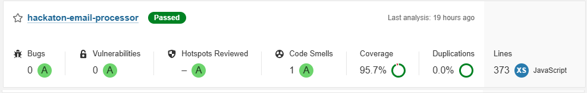
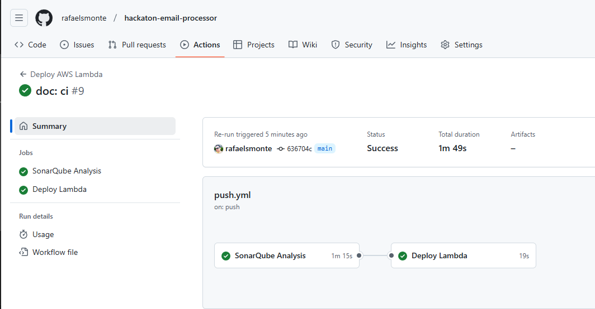
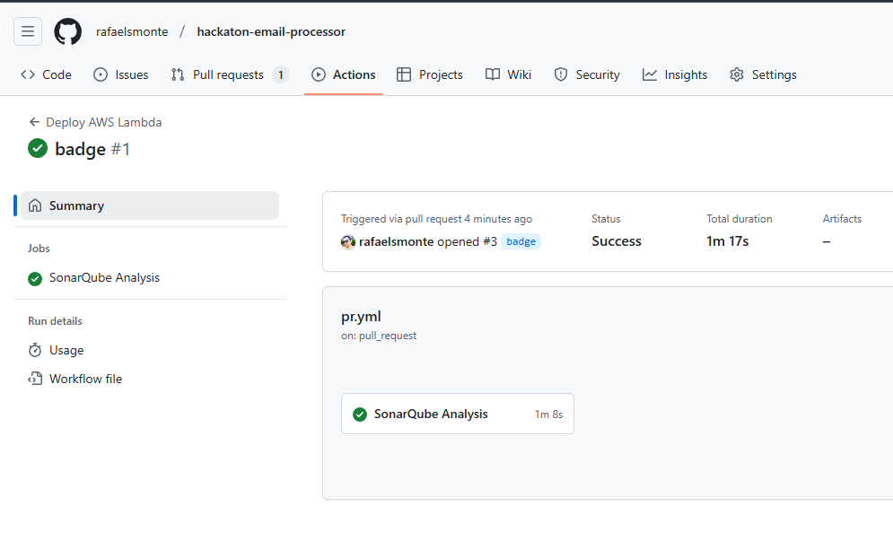

## Hackathon 7SOAT User Accounts Lambda Service - FIAP

This project implements lambda function to integrate with an external email service for sending email to users.

- [Documentation](docs/service.md)
- [CI/CD](docs/ci-cd.md)

### Authors

- _Rafael Santos Monte (RM355045)_
- _Thiago Thalison Firmino de Lima (RM354998)_
- _Vitor Manoel da Silveira (RM355029)_

### Coverage

