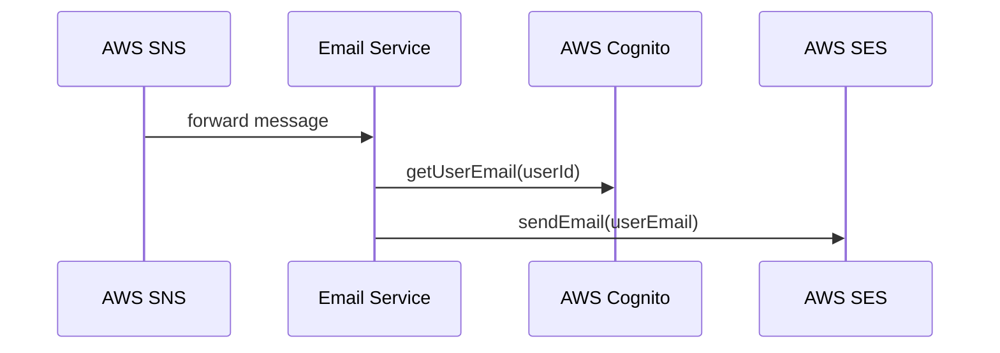

### **Handling Email Notifications for Video Processing Events**

This function listens for event notifications and sends email alerts based on video processing outcomes. It integrates with AWS SNS for event reception, AWS Cognito for user email retrieval, and AWS SES for email delivery.

### **1. Receiving the Event Notification**

- The function is triggered by incoming event notifications.
- Events are received from AWS SNS, containing structured messages related to video processing.
- Each event is extracted, parsed, and validated before further processing.

### **2. Identifying the Message Type**

- The function determines the event type to generate appropriate email content.
- Supported event types include:
  - **Video Processing Success**: Indicates that video snapshots were successfully extracted.
  - **Video Processing Error**: Indicates a failure in the video snapshot extraction process.
- If the event type is unrecognized, it is logged and skipped.

### **3. Retrieving the User’s Email Address**

- The system retrieves the recipient’s email using the associated user ID.
- AWS Cognito is queried to obtain the registered email address for the user.
- If the lookup fails, the error is logged, and the process moves to the next event.

### **4. Composing and Sending the Email**

- Based on the event type, the system constructs the email subject and body.
- Email details include:
  - Video description;
  - Video processing status;
  - Relevant URLs (video URL, snapshot images URL - from AWS S3);
  - Error messages (if applicable).
- The email is sent using AWS SES, ensuring secure and reliable delivery.

### **5. Error Handling and Logging**

- All processing steps are logged for debugging and monitoring.
- Failures in email retrieval or sending are recorded without halting overall execution.
- The function returns a success response upon processing all event records.
